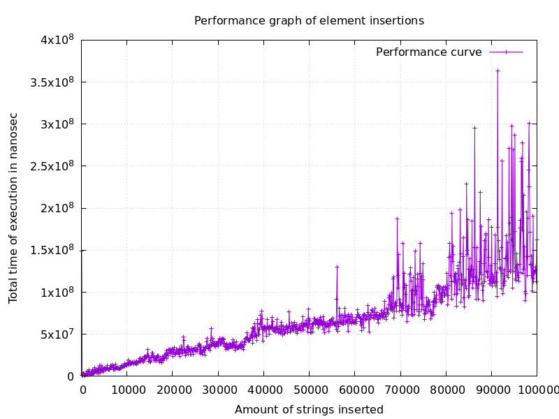
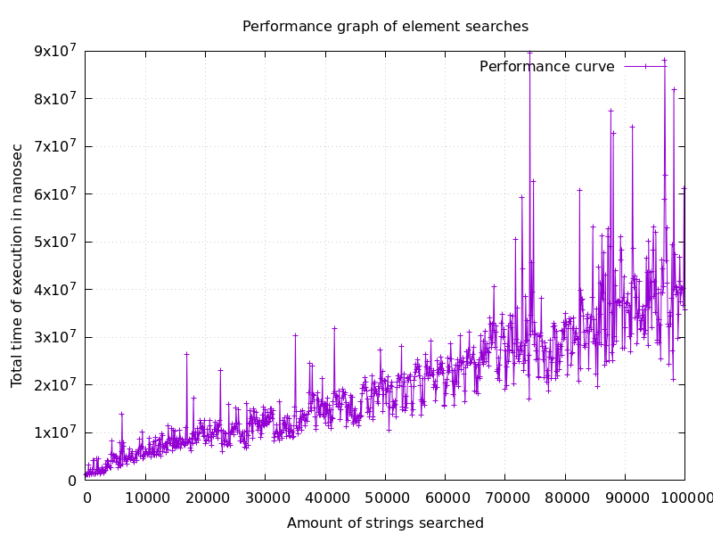

### Описание
Это простая тестирующая система для базы данных, которая проводит тест сначала на добавление, а потом на поиск добавленных значений. Измерения записываются в 2 разных графика.

### Необходимые программы для работы
1) gnu g++ не раньше c++11
2) gnu make
3) gnuplot

### Метод использования
По умолчанию в проект внесена написанная база данных в файлах Main.c, HashTable.c и HashTable.h.
Для добавления другой программы на тестирование либо замените данные файлы своими, либо добавьте свои файлы в папку проекта и измените HASHSRCS в мэйкфайле на новые.
Параметры тестирования задаются через переменные в 'config.h'.
Для компиляции тестирующей системы и программы просто наберите в консоль 'make'. После этого сгенерируются файлы hash.exe - тестируемая программа; test.exe - тестирующая программа; testGen.exe - генератор тестов.
Для того, чтобы сразу запустить тестирование наберите 'make run'.
Для создания графика наберите 'make graph'.
Для проверки корректности работы программы существует демо-режим который компилируется командой 'make demo'. Он не несет никаких значимых измерений, но проверяет корректность работы тестировщика и генератора тестов.
Для очистки проекта наберите 'make clean'. Это удалит все кроме исходных файлов.
Удачи!

### Полученные графики при тестировании 

